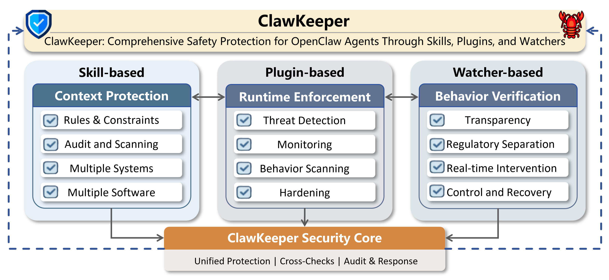

# 🦞🛡️ ClawKeeper — Comprehensive Safety Protection for OpenClaw

    

  <strong>SAFETY EXFOLIATE! SAFETY EXFOLIATE!</strong>

  
  

**ClawKeeper** is a _comprehensive real-time security framework_ designed for autonomous agent systems such as **OpenClaw**. It provides unified protection through three complementary approaches: **skill-based** safeguards at the instruction level, **plugin-based** enforcement at the runtime level, and a **watcher-based** independent monitoring agent for external oversight.

# 🔎 Overview

**ClawKeeper** provides protection mechanisms across three complementary architectural layers:

- **Skill-based Protection** operates at the instruction level, injecting structured security policies directly into the agent context to enforce environment-specific constraints and cross-platform boundaries. 

- **Plugin-based Protection** serves as an internal runtime enforcer, providing configuration hardening, proactive threat detection, and continuous behavioral monitoring throughout the execution pipeline. 

- **Watcher-based Protection** introduces a novel, decoupled system-level security middleware that continuously verifies agent state evolution. It enables real-time execution intervention without coupling to the agent's internal logic, supporting operations such as halting high-risk actions or enforcing human confirmation. 

Importantly, **Watcher-based Protection** is **system-agnostic** and can be integrated with different agent platforms to provide regulatory separation between task execution and safety enforcement, enabling **proactive** and **adaptive** security across the entire agent lifecycle. It can be deployed both **locally** and in the **cloud**, supporting personal deployments as well as enterprise or intranet environments.

# 🔥 Updates
- [2026-03-25] 🎉 ClawKeeper v1.0 has been released.

# 💡 Features

## What they do

### I. Skill-based Protection

| Feature | Description | Other Work |
|---------|-------------|-------------|
| **Safety Rules and Constraints** | Define and identify risky behaviors related to OpenClaw, including Prompt Injection, Credential Leakage, Code Injection, Privilege Tampering and so on. Security policies are persistently written into `AGENTS.md` to constrain and regulate OpenClaw’s behavior. | [OpenGuardrails](https://github.com/openguardrails/openguardrails), [OSPG](https://github.com/gulou69/openclaw-safety-guardian), [ClawSec](https://github.com/prompt-security/clawsec), [openclaw-security-practice-guide](https://github.com/slowmist/openclaw-security-practice-guide)  |
| **Periodic Security Scanning** | Perform periodic security scans of the runtime environment, configuration files, and dependencies, and generates potential risk reports. | [openclaw-security-practice-guide](https://github.com/slowmist/openclaw-security-practice-guide) |
| **Session History Summarization and Auditing** | Support recording the entire interaction history between users and OpenClaw, and performs periodic summarization, auditing, and risk analysis to identify potential security issues. | - |
| **Multi-Operating System Support** | Support security protection and risk detection for OpenClaw across Linux, Windows, and macOS environments. | [ClawSec](https://github.com/prompt-security/clawsec), [clawscan-skills](https://github.com/autosecdev/clawscan-skills) |
| **Multi-Platform Software Support** | Support platform-specific security protection for OpenClaw when integrated with platforms such as Feishu (Lark) and Telegram. | [ClawSec](https://github.com/prompt-security/clawsec) |

---

### II. Plugin-based Protection

| Feature | Description | Other Work |
|---------|-------------|-------------|
| **Threat Detection** | Covers the majority of security risks outlined in the OWASP Agent Security Initiative (ASI) and OpenClaw Security threat categories. | [OpenClaw Shield](https://github.com/knostic/openclaw-shield), [OpenGuardrails](https://github.com/openguardrails/openguardrails), [SecureClaw](https://github.com/adversa-ai/secureclaw) |
| **Real-time Monitoring and Logging** | Monitor the entire OpenClaw workflow in real time, including user inputs, agent outputs, and tool calls, and maintains complete logs for security auditing and traceability. | [OpenClaw Shield](https://github.com/knostic/openclaw-shield), [OCSG](https://github.com/gulou69/openclaw-safety-guardian), [OpenGuardrails](https://github.com/openguardrails/openguardrails), [ClawBands](https://github.com/SeyZ/clawbands) |
| **Behavioral Security Detection** | Perform comprehensive behavioral security analysis on OpenClaw, including detection of prompt injection attacks, credential leakage, dangerous command execution, and high-risk operations, and generates security risk reports. | [ClawBands](https://github.com/SeyZ/clawbands) |
| **Configuration File Protection** | Protect the integrity of the critical configuration file openclaw.json and detects any malicious tampering.. | [SecureClaw](https://github.com/adversa-ai/secureclaw) |
| **Security Hardening** | Provide risk remediation commands, security hardening recommendations, and configuration optimization suggestions based on security scan and detection reports. | [SecureClaw](https://github.com/adversa-ai/secureclaw) |

### III. Watcher-based Protection: OpenClaw Overseeing OpenClaw

| Feature | Description | Other Work |
|---------|-------------|-------------|
| a | a | a |

## Comparison

ClawKeeper offers a comprehensive suite of security mechanisms, allowing users to freely select and combine them according to their specific requirements, whether prioritizing runtime efficiency or security performance.

# 📦 Details and Installation

- 📚 [Skill-based Protection](clawkeeper-skill/README.md)
- 📚 [Plugin-based Protection](clawkeeper-plugin/README.md)
- 📚 [Watcher-based Protection](clawkeeper-watcher/README.md)

# 📝 License

This project is licensed under [MIT](https://opensource.org/licenses/MIT).